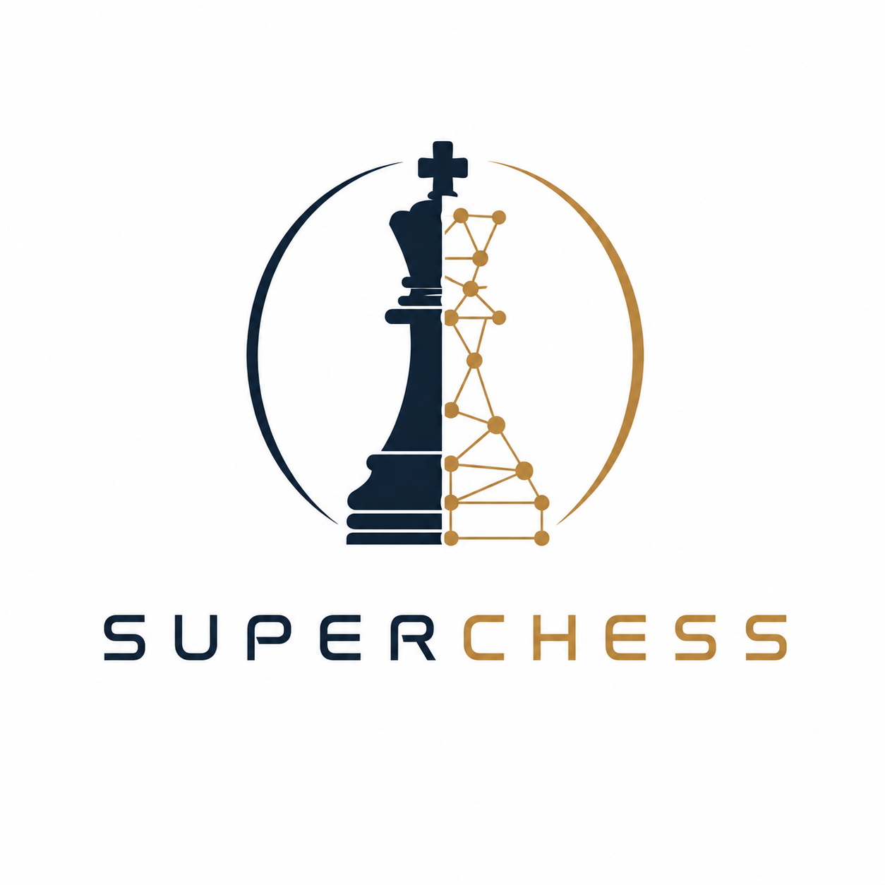
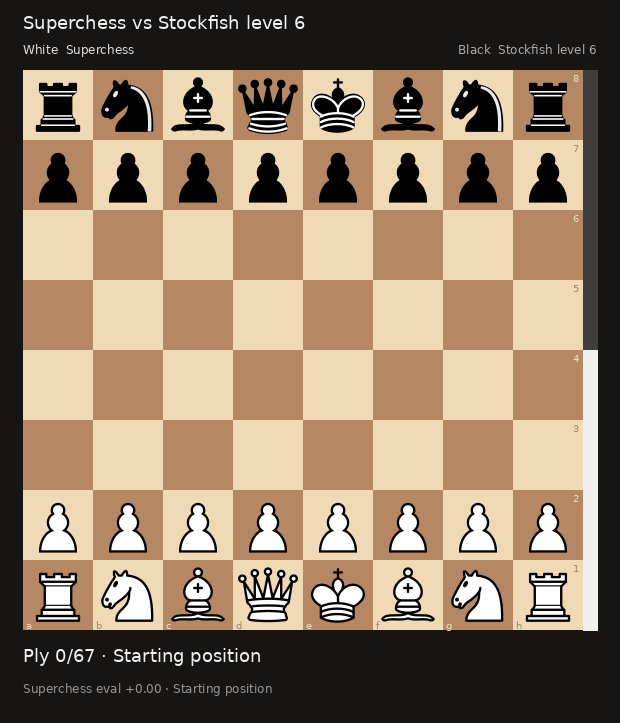
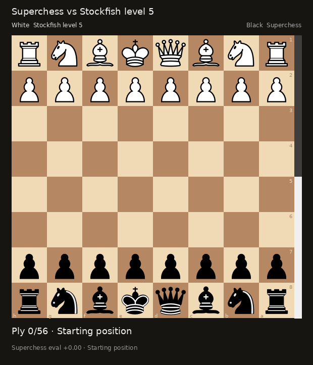

# Superchess

<p align="center">
	
</p>

A supervised CNN+Transformer chess-engine project for CCRL preprocessing, policy/value training, and neural MCTS.

The data path is optimized around CCRL 40/15 commented PGNs and rating metadata. The default cutoff is 3500 Elo, using the current CCRL rating list to decide which engine games to keep.

## Quick Start

```bash
python -m venv .venv
source .venv/bin/activate
python -m pip install -U pip
python -m pip install -e ".[dev,extract,evals]"
```

Install PyTorch with the CUDA wheel that matches your driver, for example:

```bash
python -m pip install torch --index-url https://download.pytorch.org/whl/cu121
```

Then run:

```bash
superchess ccrl download --out data/raw --min-elo 3500
superchess ccrl preprocess --raw data/raw --out data/processed --min-elo 3500
superchess train --data data/processed --data-format games --out checkpoints/superchess.pt --epochs 1
superchess search --checkpoint checkpoints/superchess.pt --fen "startpos" --simulations 128
```

Training holds out 5% of NPZ shards for validation by default and reports `val_*`
metrics in the checkpoint JSON. Use `--validation-fraction 0` to disable the
split, or adjust `--validation-seed` for a different deterministic shard holdout.
Checkpoints trained before the policy square-order or 20-plane board-pack format
fixes should be retrained. Legacy checkpoints are rejected by search, evaluate,
and the GUI unless you explicitly pass `--allow-legacy-checkpoint`.

For Stockfish eval distillation instead of CCRL game-result training, install the
`evals` extra, preprocess the Lichess dump, and keep the default eval data format:

```bash
superchess evals download --out data/raw
superchess evals preprocess --raw data/raw --out data/processed
superchess train --data data/processed --data-format evals --out checkpoints/superchess.pt --epochs 1
```

## Play in the GUI

The GUI auto-detects an installed `stockfish` executable from `PATH` (including
the usual `/usr/games` location). Launch it normally:

```bash
superchess gui --checkpoint checkpoints/superchess.pt
```

If Stockfish is not on `PATH`, pass it explicitly:

```bash
superchess gui --checkpoint checkpoints/superchess.pt --stockfish /path/to/stockfish
```

A Lichess-style analysis board opens automatically at `http://127.0.0.1:8000/`.
It features crisp SVG pieces, drag-and-drop moves with legal-move hints, a live
evaluation gauge, MultiPV engine lines, an evaluation graph, move and material
tracking, editable FEN/PGN fields, responsive layouts, board themes, and an
in-board promotion chooser. Select **Play** to reveal a prominent White, Black,
or Both side picker; choosing a side keeps the current position and lets the bot
move whenever it is its turn. Engine strength, PV length, exploration, arrows,
flipping, undo, and hints remain configurable. The backend uses only the standard
library plus python-chess, so no extra dependencies are required.



Select **Arena** to run an automatic **Superchess vs Stockfish** match. Choose
which color Superchess plays and a Lichess Stockfish level from 1 through 8,
then start, pause, or resume the game. These are the pinned
`lichess-org/fishnet` move presets (the time and depth limits are both sent, so
the first reached limit stops the search):

| Lichess level | Skill Level | Move time | Depth |
|---:|---:|---:|---:|
| 1 | -9 | 50 ms | 5 |
| 2 | -5 | 100 ms | 5 |
| 3 | -1 | 150 ms | 5 |
| 4 | 3 | 200 ms | 5 |
| 5 | 7 | 300 ms | 5 |
| 6 | 11 | 400 ms | 8 |
| 7 | 16 | 500 ms | 13 |
| 8 | 20 | 1000 ms | 22 |

Fishnet uses one thread, 16 MB hash, one PV, and disables `UCI_LimitStrength`.
The Arena panel shows these exact requested values. Stockfish 16 advertises a
skill range of 0–20, so its effective skill for levels 1–3 is shown explicitly
as 0 while the exact Lichess time/depth limits are retained.

The vertical evaluation gauge and evaluation graph are always produced by
Superchess, including immediately after Stockfish moves. Stockfish's score is
used only for its own search-line display. Opening names come from a pinned copy
of Lichess's 3,790-position CC0 ECO database; classification walks backward
through the real game history, so the last valid opening remains stable in the
middlegame and common transpositions are recognized.

Arena games can be downloaded as tagged PGN, `superchess-replay-v1` JSON, or a
ready-to-share animated GIF. GIF frames use the same Lichess-style board theme,
Cburnett SVG pieces, orientation, coordinates, check marker, and last-move
highlighting as the browser GUI. They also include player names, the stable
opening name, and the Superchess evaluation gauge. Rendering never reruns either
engine. A saved replay can also be rendered later from the command line:



```bash
superchess gif --replay game.replay.json --out game.gif
```

The downloader first tries the smaller per-engine commented archives for engines above the Elo cutoff and falls back to the full commented archive if needed. For smoke tests, limit work before touching the full database:

```bash
superchess ccrl download --out data/raw --min-elo 3500 --max-archives 2
superchess ccrl preprocess --raw data/raw --out data/processed --min-elo 3500 --max-games 100 --verbose
```

## Design

- Perspective-normalized board planes keep the model invariant to side to move.
- AlphaZero-style 4672-action policy targets cover legal queen-like moves, knights, and underpromotions.
- Preprocessing writes NPZ shards with packed bit planes for fast sequential reads; add `--compressed` when disk space matters more than load speed.
- Training unpacks batches vectorized in the collate function and uses AMP, channels-last tensors, and optional `torch.compile`.
- MCTS masks policy logits to legal moves and evaluates positions on GPU when PyTorch CUDA is available.
